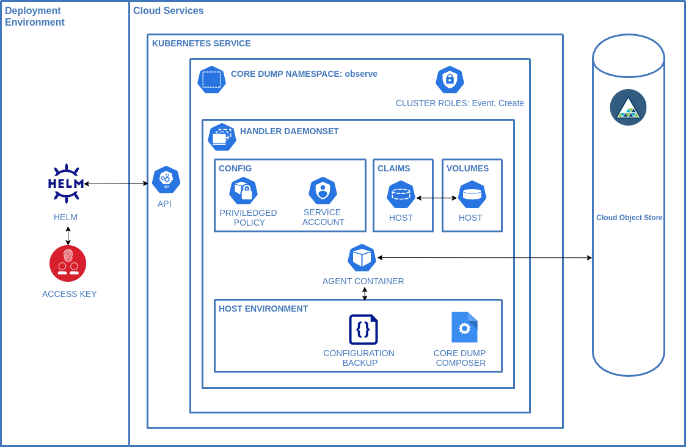

## Background

**Originally posted at https://developer.ibm.com/tutorials/conducting-a-post-mortem-analysis-of-nodejs-applications-on-ibm-cloud-kubernetes-services/**

Understanding what causes an application to fail is critical to creating a healthy cloud infrastructure. In my current role, I work directly with customers to help them navigate their cloud adoption journey. As part of this role, I collaborate with them on best practices for creating, building, and maintaining their cloud infrastructure.

As organizations adopt cloud-centric technologies such as containers, they find holes in their operating model. For the most part, these gaps always existed, but the acceleration in their software development lifecycle highlights these shortfalls sooner. One key aspect of an organization's cloud operating model is *observability*, which is the ability to understand the internal state of a system from the available outputs. Most organizations focus their observability efforts on logging and monitoring, but other debugging techniques include tracing and post-mortem analysis.

*Post-mortem analysis (PMA)* is the ability to take a snapshot of a process just as it's failing so that you can examine the snapshot away from the production environment. While this has been possible on traditional VM-based environments, using PMA in a container environment hasn't been clear.

In this tutorial, I walk you through a sample scenario that demonstrates how to manage and debug a crashing Node.js process to help you understand the benefits of post-mortem analysis and how to use it effectively. I show you how to install a core dump handler and analyzer and how to use them with a crashing Node.js process.

Although this article focuses on Node.js, you can apply this flow to any runtime including Java, Go, Rust, and more.

## A brief introduction to post-mortem analysis

Post-mortem analysis refers to the technique of collecting a core dump and ancillary information when a process crashes and using that information to diagnose what caused the process to fail. Core dumps are one of the oldest debugging techniques. Check out an in-depth piece about [core dumps and how they're generated](https://venshare.com/blog/what-is-a-core-dump/) on my personal blog.

Until the introduction of Kubernetes, post mortem analysis in Linux containers was a thorny and unresolved item. As [this issue](https://github.com/moby/moby/issues/11740) highlights, the interaction between the host and the container runtime for system facilities was never resolved satisfactorally. Kubernetes solved this problem by offering [pod policies](https://kubernetes.io/docs/concepts/policy/pod-security-policy/) as a way to safely access host resources in a manageable way and provide a route to bring a rich investigation technique to the container ecosystem.

## Prerequisites

To complete the steps in this tutorial, you need to:

* Create an [IBM Cloud account](https://cloud.ibm.com/login?cm_sp=ibmdev-_-developer-tutorials-_-cloudreg)
* Ensure you have [virtual routing and forwarding enabled](https://cloud.ibm.com/docs/account?topic=account-vrf-service-endpoint) on your cloud account.
* Set up an [IBM Kubernetes Service Instance](https://cloud.ibm.com/kubernetes/catalog/create?cm_sp=ibmdev-_-developer-tutorials-_-cloudreg) **or** a [Red Hat OpenShift Kubernetes Service Instance](https://cloud.ibm.com/kubernetes/catalog/create?platformType=openshift?cm_sp=ibmdev-_-developer-tutorials-_-cloudreg)

    ```
    $ ibmcloud plugin install kubernetes-service
    ```

* Install [helm](https://helm.sh/docs/intro/install/) which is used to deploy services.

If you are deploying into OpenShift, then [oc](https://mirror.openshift.com/pub/openshift-v4/clients/oc/) is also required as well as the IBM Cloud CLI.

## Component overview

In this tutorial, I show you how to install the following components, crash a process, and then debug the crashed process.

* **Core dump handler**: Responsible for deploying the core processor on the host to take the crashed process from the container to IBM Cloud Object Storage


* **Core dump client**: A cli that will access cloud object storage and create a container to provide a debug environment.


* **Crashing Node.js application**: The [sample application](https://github.com/No9/example-crashing-nodejs-app/) that we are going to debug


## Steps

1. [Create an object storage instance](#step-1-configure-cloud-object-storage)
1. [Install a core dump handler](#step-2-install-a-core-dump-handler)
1. [Install the debugger client](#step-3-install-the-debugger-client)
1. [Run a crashing service](#step-4-create-a-core-dump)
1. [Validate the image](#step-5-validate-the-image)
1. [Start Debugging](#step-6-start-debugging)
1. [Inspect the contents of the debug environment](#step-7-inspect-the-contents-of-the-debug-environment)
1. [Start a debugging session](#step-8-start-a-debugging-session)
1. [Clean up](#step-9-clean-up)

## Step 1. Configure cloud object storage

Follow the [instructions here](https://cloud.ibm.com/docs/cloud-object-storage?topic=cloud-object-storage-getting-started-cloud-object-storage) to create an object storage instance and a bucket.
Then generate HMAC credentials [following this link](https://cloud.ibm.com/docs/cloud-object-storage?topic=cloud-object-storage-uhc-hmac-credentials-main) you will need these for the next step.

## Step 2. Install a core dump handler

Now you need to install the [IBM Core Dump Handler](https://artifacthub.io/packages/helm/core-dump-handler/core-dump-handler) in either [IBM Kubernetes Service](https://cloud.ibm.com/docs/containers?topic=containers-getting-started) or [RedHat OpenShift Kubernetes Service](https://cloud.ibm.com/kubernetes/catalog/create?platformType=openshift&cm_sp=ibmdev-_-developer-tutorials-_-cloudreg).

1. Add the helm repo to your local helm instance

    ```
    helm repo add core-dump-handler https://ibm.github.io/core-dump-handler/
    ```
2. Configure your local kubectl client using the ibmcloud cli

    ```
    ibmcloud ks cluster config -c NAME_OF_CLUSTER
    ```
3. Install the chart using the HMAC configuration from the first step.

    ```
    helm install my-core-dump-handler core-dump-handler/core-dump-handler --create-namespace --namespace observe \
    --set daemonset.s3AccessKey=XXX --set daemonset.s3Secret=XXX \
    --set daemonset.s3BucketName=XXX --set daemonset.s3Region=XXX
    ```
4. On a successful install you will be able to see the logs in the my-core-dump-handler daemonset on the node.

    ```
    kubectl logs -n observe -l name=core-dump-ds
    ```
## Step 3. Install the debugger client

1. Download the latest cli for your operating system from the [core-dump-client release page](https://github.com/IBM/core-dump-client/releases).

2. Install the client into your a location on your local $PATH.

## Step 4. Create a core dump

The code in the [example-crashing-nodejs-app](https://github.com/No9/example-crashing-nodejs-app/) project is a sample app that will automatically generate a coredump.

The [project code](https://github.com/No9/example-crashing-nodejs-app/blob/main/index.js) has three nested calls inside a main function with the final call creating an explicit [`throw`](https://github.com/No9/example-crashing-nodejs-app/blob/main/index.js#L14).

Just enough for you to see how the call stack lays out for an application and do some investigation around that.

example-crashing-nodejs-app is a normal nodejs project with the additional runtime flag of `--abort-on-uncaught-exception` in the [entrypoint.sh](https://github.com/No9/example-crashing-nodejs-app/blob/master/entrypoint.sh#L2).

Run the projec with the following command.

```
kubectl run -i -t node-crasher --image=quay.io/icdh/example-crashing-nodejs-app --restart=Never
```

## Step 5. Validate the image

Now look in your object storage instance and find the name of the zip file that was created.

e.g. a686e8f6-1b46-4e71-9d1a-3c65079ca686-dump-1634419098-node-crasher-node-8-4.zip

Each item in the name breaks down as
* a686e8f6-1b46-4e71-9d1a-3c65079ca686 - The guid to ensure the name is unique.
* dump - the type of zip
* 1634419098 - the time the dump occurred
* node-crasher - the name of the application (N.B this is truncated)
* 8 - The pid of the process 
* 4 - The signal that was sent to the process

## Step 6. Start debugging

Now you can run the `cdcli` command to start a debugging session.

An example command is:
```
cdcli -c a686e8f6-1b46-4e71-9d1a-3c65079ca686-dump-1634419098-node-crasher-node-8-4.zip   -i quay.io/icdh/example-crashing-node-app
```

Where the `-c` option is the core zip file in the bucket.
The original image is referenced with the `-i` option.

A full list of config options can be seen by running
```
cdcli --help
```

Once you have ran the cdcli command You will be presented with the following output.

```
Debugging: example-crashing-nodejs-app
Runtime: nodejs
Namespace: observe
Debug Image: quay.io/icdh/nodejs
App Image: quay.io/icdh/example-crashing-nodejs-app
Sending pod config using kubectl
stdout: debugger-06e3166c-f113-4291-81f8-8cf2839942c1
Defaulted container "debug-container" out of: debug-container, core-container
error: unable to upgrade connection: container not found ("debug-container")

Retrying connection...
Defaulted container "debug-container" out of: debug-container, core-container
```
If for some reason the container fails to start the you can kill the session by pressing `CTL-C`

Notice the cdcli will keep retrying to connect to the container if it isn't started yet.

You are now logged into a container on the kubernetes cluster and will see a command prompt.
```
[debugger@debugger-06e3166c-f113-4291-81f8-8cf2839942c1 debug]$
```
## Step 7. Inspect the contents of the debug environment

Now run an `ls` command to see the content of the folder.
```
ls
a686e8f6-1b46-4e71-9d1a-3c65079ca686-dump-1634419098-node-crasher-node-8-4  a686e8f6-1b46-4e71-9d1a-3c65079ca686-dump-1634419098-node-crasher-node-8-4.zip
init.sh
rundebug.sh
```
You can see the folder containing the core dump and some helper scripts.
The `init.sh` script is used by the system to layout the folder structure and isn't needed for debugging.

Run the `env` command to see that the location of the core file and the executable are available as environment variables.
```
...
S3_BUCKET_NAME=cos-core-dump-store
EXE_LOCATION=/shared/node
PWD=/debug
HOME=/home/debugger
CORE_LOCATION=a686e8f6-1b46-4e71-9d1a-3c65079ca686-dump-1634419098-node-crasher-node-8-4/a686e8f6-1b46-4e71-9d1a-3c65079ca686-dump-1634419098-node-crasher-node-8-4.core
...
```

## Step 8. Start a debugging session

You can now start a debug session by simply running the `rundebug.sh` script in the pod.
```
./rundebug.sh
```
You will see the command that is ran and be given the lldb command prompt with the core and the exe preloaded.
```
(lldb) target create "/shared/node" --core "a686e8f6-1b46-4e71-9d1a-3c65079ca686-dump-1634419098-node-crasher-node-8-4/a686e8f6-1b46-4e71-9d1a-3c65079ca686-dump-1634419098-node-crasher-node-8-4.core"
Core file '/debug/a686e8f6-1b46-4e71-9d1a-3c65079ca686-dump-1634419098-node-crasher-node-8-4/a686e8f6-1b46-4e71-9d1a-3c65079ca686-dump-1634419098-node-crasher-node-8-4.core'
(x86_64) was loaded.
(lldb)
```

Now you are ready to start inspecting the core dump.

First you can now look at the backtrace by running the `v8 bt` command
```
v8 bt
  thread #1: tid = 8, 0x0000000000983719 node`v8::base::OS::Abort() + 9, name = 'node', stop reason = signal SIGILL
    frame #0: 0x0000000000983719 node`v8::base::OS::Abort() + 9
    frame #1: 0x0000000000d16331 node`v8::internal::Isolate::CreateMessageOrAbort(v8::internal::Handle<v8::internal::Object>, v8::internal::MessageLocation*) + 161
    frame #2: 0x0000000000d16475 node`v8::internal::Isolate::Throw(v8::internal::Object, v8::internal::MessageLocation*) + 309
    frame #3: 0x000000000109bc1c node`v8::internal::Runtime_Throw(int, unsigned long*, v8::internal::Isolate*) + 60
    frame #4: 0x0000000001446379 <exit>
    frame #5: 0x00000000014cc0dd <stub>
    frame #6: 0x00000000013dcea2 bar(this=0x4449d40b09:<Global proxy>, 0x38edbef53b81:<String: "hello world">) at /home/node/app/index.js:12:13 fn=0x000038edbef53b41
    frame #7: 0x00000000013dcea2 foo(this=0x4449d40b09:<Global proxy>, 0x38edbef53b81:<String: "hello world">) at /home/node/app/index.js:8:13 fn=0x000038edbef53b01
    frame #8: 0x00000000013dcea2 do_test(this=0x4449d40b09:<Global proxy>) at /home/node/app/index.js:3:17 fn=0x000038edbef53ac1
    frame #9: 0x00000000013dcea2 914182(this=0x38edbef51dd1:<Object: Object>, 0x38edbef51dd1:<Object: Object>, 0x38edbef535c9:<function: require at internal/modules/cjs/helpers.js:1:10>, 0x38edbef51be1:<Object: Module>, 0x38edbef50371:<String: "/home/node/app/i...">, 0x38edbef534f9:<String: "/home/node/app">) at /home/node/app/index.js:1:0 fn=0x000038edbef53271
    frame #10: 0x00000000013dcea2 914182(this=0x38edbef51be1:<Object: Module>, 0x38edbef53099:<String: "do_test()

```
You could use the long hand
```
thread backtrace all
```

You can see at the start that the program exited with a `SIGILL` or segmentation fault raised by the panic in our code.

The call stack represents the order of calls as they were executed before the panic.
Let's select the last call in our logic before the the first panic was raised.
In the example output that would be `frame #6`
Type the command or the line that corresponds to `bar(this=0x4449d40b09`
```
f 6
```
This is short hand for the following which can also be typed.
```
frame select 6
```
The output of either command will be
```
node`Builtins_InterpreterEntryTrampoline:
->  0x13dcea2 <+194>: addb   %al, (%rax)
    0x13dcea4 <+196>: addb   %al, (%rax)
    0x13dcea6 <+198>: addb   %al, (%rax)
    0x13dcea8 <+200>: addb   %al, (%rax)
```

The output represents the currently selected frame and shows the instructions the machine code associated with the frame.
This isn't much use for debugging application level issues but the lldb v8 plugin can help us here.
With `v8 source list` we can see the javascript code associated with the frame.
```
v8 source list
  12 function bar(input) {
  13   console.log("{}", input);
  14   throw "Boom!";
  15 }
```

We can also use the v8 module to find counts of specific objects.

```
v8 findjsobjects
```
Which gives us a list of the different types of objects when the container crashed.
```
 Instances  Total Size Name
 ---------- ---------- ----
          1         24 AbortError
          1         24 AsyncLocalStorage
          1         24 AsyncResource
          1         24 Blob
          1         24 DOMException
          1         24 Dir
          1         24 Dirent
          1         24 DirentFromStats
          1         24 ERR_INVALID_THIS
          1         24 FastBuffer
...

To see a full list of the commands available run
```
v8 help
```

## Step 9 Clean up

1. Now quit the debugger.
    ```
    quit
    ```

2. And exit the pod
    ```
    exit
    ```

The debugging pod should now be deleted
```
pod "debugger-e2775f05-a5ff-4023-80fc-a14180c3b9e6" deleted
```
## Summary

Well done you've just completed a core dump analysis on a Node.js application!
You should now be able to understand the benefits of capturing cores as they provide a very easy way to capture issues in environments that aren't easy to access and should also give you the confidence to panic applications when they reach an unknown state rather than trying to make erroneous computations.

## Future work

RBAC and/or Namespace partitioned access to the dumps. Core dumps carry sensitive data and a debug user currently has read only access to all the core dumps taken on the cluster. Organisations would probably want to restrict that and integrate it with their standard authentication systems as well as providing scrubbing for sensitive information such as credit card info etc.

Take arbitrary core dumps - Unfortunately apps don't always crash when they are misbehaving. They can become totally unresponsive or possibly even worse just respond slowly. Core dumps can help in those scenarios to so it would be nice to use a tool like `gcore` from a privileged pod to take a snapshot of a running application.

### Thanks

Emily Mitchell, Gireesh Punathil, Beth Griggs, Joe Sepi, Michael Dawson &mdash; Thanks for suggesting that this may be of interest to the wider world, helping me navigate the review process and providing feedback.
