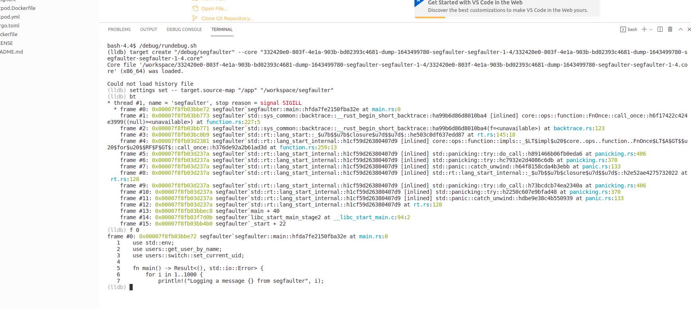
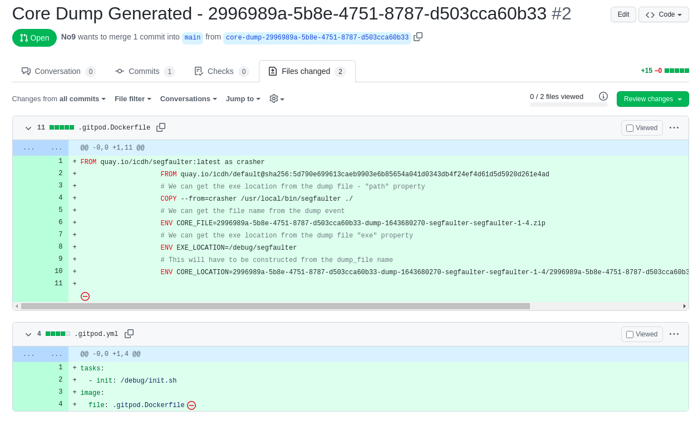

## Background

I've been working a lot on [gitops](https://docs.openshift.com/container-platform/4.7/cicd/gitops/understanding-openshift-gitops.html) in kubernetes recently.
Mainly focused on delivery pipelines but it struck me that the [core dump handler](https://github.com/IBM/core-dump-handler) project I work on could really be enhanced with this approach.

The [core dump handler](https://github.com/IBM/core-dump-handler) takes a process that has crashed in kubernetes along with related pod information and uploads it to an S3 protocol compatible storage service. It's getting some adoption but the question of how someone can use the core dump to analyse the crash afterwards hasn't really been fleshed out.

I have been kicking around a [client cli](https://github.com/IBM/core-dump-client) that provides a way to start a preconfigured container with a core dump loaded up but it didn't really provide a complete answer.

The cli was ok (ish) but it suffered from the following problems:

1. The user had to know the process for the image that had crashed in order to use it.

2. It was mearly a wrapper around kubectl and so had a lot of client side dependencies

3. It didn't provide a familiar environment for the developer.

I knew I just wasn't thinking about the problem in the right way so I left it and waited for my old friend serendipity to help.

And help she did.

## Discovering gitpod.io

Browsing the tech feeds I came across [gitpod.io](https://www.gitpod.io/) which allows you to create on demand containers for a github repo.
Just give it a url like http://gitpod.io/#https://github.com/username/project and it spins up a remote coding session with a console into a pod.
This is exactly what I was trying to do with my cli project.

Even better was the fact that I could integrate the [Dockerfile](https://github.com/IBM/core-dump-client/blob/main/default/Dockerfile) I had already defined for my cli as part of the gitpod build process using [a simple config](https://www.gitpod.io/docs/config-docker). This docker file is layered into the workspace creation process so the final result is an running gitpod with a development UI and additional post mortem tooling.

## Integrating with Github

Now all I need to do is create a PR to a github repo with the configuration and it would be golden.

Most object storage services provide an eventing system that will notify you when an object is saved. My default cloud provider (and current employer) is IBM Cloud and they provide a [knative](https://knative.dev/docs/) service called [Code Engine](https://www.ibm.com/cloud/code-engine) that enables you to fire a function each time an object is saved.
There is a lot more details in the [tutorial here](https://cloud.ibm.com/docs/codeengine?topic=codeengine-subscribe-cos-tutorial) on how that is done.

In order to build the function I used the [kn func addon](https://github.com/knative-sandbox/kn-plugin-func/blob/main/docs/README.md) which provides a project scaffold based on [fastify](https://www.fastify.io/) that can be filled out and compiled into a container and hosted in Code Engine.

A [quick hack session](https://github.com/IBM/core-dump-client/blob/main/knative-event-processor/index.js) to take the core-dump zip and create a PR with all the configuration that's required.

An example of the PR is available here https://github.com/No9/segfaulter/pull/2

The PR can then simply be opened with the gitpod url - https://gitpod.io/#https://github.com/No9/segfaulter/pull/2

If your interested in seeing this running then follow the deploy steps here - https://github.com/IBM/core-dump-client/tree/main/knative-event-processor#deployment

It requires an [IBM Cloud account](https://cloud.ibm.com/registration) at the moment but you will be able to run the kubernetes cluster and the knative services for free.

## Next Steps

While I'm happy with the direction the overall implementation isn't very robust and there is still redundant aspects that would be good to get rid of.
There is no reason why the core dump handler can't call out to a knative compatible endpoint directly as it has already parsed the files.

This eventing mechanism would make the post processing that creates the PR a lot more light weight as it wouldn't need to download the corefile to create the PR.
It would also make the hosting of the code a lot less platform specific as all the cloud providers event out of their object storage in different ways.

 I am [discussing that eventing mechanisms here](https://github.com/IBM/core-dump-handler/discussions/61).
