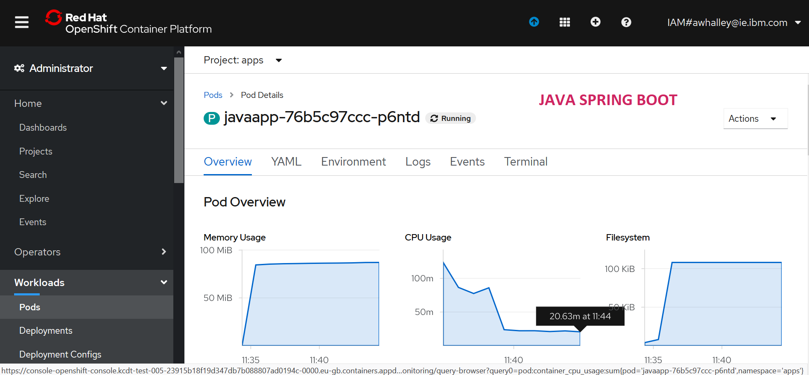

Recently I have been working with [Appsody](https://appsody.dev/) an [open source](https://github.com/appsody/) development and operations accelerator for containers.

Appsody is targeting a classic problem in software adoption.

> How do organisations leverage new technology while keeping a reasonable set of guard rails in place?

In short appsody allows you to create predefined and configured software [stacks](https://appsody.dev/docs/stacks/stacks-overview) to enable teams of developers to create, run, build and deploy production ready cloud native apps in an incredibly short space of time when compared to normal app life cycles.

So I thought I would take appsody and mix it up with another topic that I am intrested in - [simple but high preformance webserver development](https://venshare.com/tags/koreio).
This led me to work on an [appsody stack](https://appsody.dev/docs/stacks/stacks-overview) for the async Rust HTTP framework [Tide](https://github.com/http-rs/tide). 

More on the [Tide stack](https://github.com/No9/rust-tide) in [later posts](https://venshare.com/tags/tide) but today I got a baseline Tide implementation up and running on the recently announced [RedHat OpenShift 4.3 Kubernetes Service (ROKS)](https://cloud.ibm.com/kubernetes/catalog/about?platformType=openshift) on [IBM Cloud](https://www.ibm.com/account/reg/ie-en/signup?formid=urx-40971).

Working with appsody is nice and simple so I also spun up the [node.js express stack](https://github.com/appsody/stacks/tree/master/incubator/nodejs-express) and the [spring boot stack](https://github.com/appsody/stacks/tree/master/incubator/java-spring-boot2) stack to compare developer flows.

Both runtimes went very smoothly from zero to deploy in minutes but as I investigated the deployments I was struck that the resource consumption between the more established frameworks and Rust-Tide in an idle state. 

> Example Pod Overview

The consumption metrics charts and the new OpenShift 4.3 UI are in the [(ScreenShots Below)](#a-namescreenshotsascreen-shots) but I have summarised them in this table.

<table>
    <thead>
    <tr><b>
        <td>Runtime</td><td>Mem<td><td>CPU</td><td>Processes/CPU</td>
    </b></tr>
    </thead>
    <tbody>
    <tr>
        <td>Java Spring Boot</td><td>~87Mb<td><td>~20m</td><td>50</td>
    </tr>
    <tr>
        <td>Node.JS Express</td><td>~47Mb<td><td>~10</td><td>100</td>
    </tr>
    <tr>
        <td>Rust Tide</td><td>~1Mb<td><td>~1m</td><td>1000</td>
    </tr>
    </tbody>
  </table>

This comparison would suggest that Rust is an order of magnitude more efficient than Node.js or Java.
> It's not surprising Rust is more efficient

It's not surprising Rust is more efficient as it's natively compiled but I hadn't considered that there would be such a difference given that none of the applications were preforming work.

As there may be a *slight lack of rigour &trade;* in the data and methodology above I went to [surf the net](https://en.wikipedia.org/wiki/Jean_Armour_Polly) to see if there has been any formal research into the area of green applications.

I was delighted to discover a group called the [Green Software Lab](https://greenlab.di.uminho.pt/) who do a lot of work in this area. Specifically they published a [paper](https://greenlab.di.uminho.pt/wp-content/uploads/2017/10/sleFinal.pdf) that considers this topic. 

> The Normalized Global Results:

The [results are interesting](https://sites.google.com/view/energy-efficiency-languages/results?authuser=0#h.p_nggWE5Z-iDZ0) with Rust closely following C in terms of energy efficiency and Java placing respectably too. It is should also be noted that python one of the worlds [most popular runtimes](https://blog.newrelic.com/technology/most-popular-programming-languages-of-2019/) places very poorly.

Reflecting more on the results I noted that Javascript placed lower than Java. 
This likely due to the tests being based on CPU intensive tasks and not on I/O based tasks that Javascript is perhaps better suited for. 

As a practioner who also cares about energy efficiency it would be useful to see this type of analysis performed against more life like workloads such as those available on [realworld.io](https://realworld.io/).

Green applications are a new topic for me but I am going to continue reading up and will checkin with any findings.

### Screen Shots

**java**

**node.js**

**rust**

