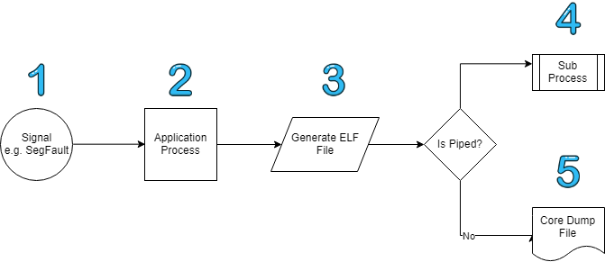

> What are core dumps?

Simply put core dumps are a snapshot of the state of a process.

Core dumps are one of the oldest forms of debugging. The name originates from a time when [magnetic cores](https://en.wikipedia.org/wiki/Magnetic-core_memory) were the main implementation of Random Access Memory(RAM) and dumps were printed out onto paper.

Today core dumps are generated by travesing the memory of a process and outputting it to an [Executable Linkable Format(ELF)](https://en.wikipedia.org/wiki/Executable_and_Linkable_Format) so that it can be interogated further.

The layout of an core dump is defined as follows

- *ELF Header* provides type and architecture information
- *Program header table* defines the process layout for the system to prepare execution
- *.text* is the definition of the program
- *.rodata* is the read-only data for the program
- *.data* stores the variables initialized by the user 
- *Section header table* presents extra information about the sections in the program

A much more detailed text description is available [in this pdf](https://venshare.com/files/ELF_Format.pdf).

A larger more detailed diagram is available [below](#elf-walkthrough) 

> How are they generated?

To understand this flow from an application developers point of view you need to recall that a when a process starts the operating system creates a wrapper around the application code to provide consistent management whatever the actual program is doing.

Typically a kernel event occours and the kernel [notifies the process of this event by signal](https://github.com/torvalds/linux/blob/b4f633221f0aeac102e463a4be46a643b2e3b819/kernel/signal.c#L2733). The process wrapper handles the signal usually through [coredump action](https://github.com/torvalds/linux/blob/18bf34080c4c3beb6699181986cc97dd712498fe/fs/coredump.c#L567).

In order to create the file the kernel traverses all the Virtual Memory Areas that belongs to the process and generates the contents to an ELF format. 

This ELF Format is then either [sent to a file](https://github.com/torvalds/linux/blob/18bf34080c4c3beb6699181986cc97dd712498fe/fs/coredump.c#L696) or [piped](https://github.com/torvalds/linux/blob/18bf34080c4c3beb6699181986cc97dd712498fe/fs/coredump.c#L627) to a downstream process. 

### elf walkthrough
