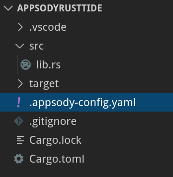
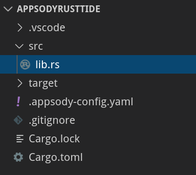

## Introduction

Following the feedback from an [Appsody on OpenShift](https://us02web.zoom.us/webinar/register/rec/WN__gBLTiqLQPiDRUkzdWWXZg?meetingId=2udFNa2s0HNOQ4nnz2LRW7A4A9jqX6a81nUe__Vcz0uAmF0Mz4Yqwn_obRPTpJuz&playId=usctfrr7_zw3GoGQ5gSDC_d6W9W5K_6s13RMrKdcnUa2AiVSN1ekbrREMOrwm00F71LWvXjt14jaBZaf&action=play&_x_zm_rtaid=5uZDfWV9RYy-J3EBnxrctQ.1590833520420.dc63c5dacd2e261a888c87d88a17324b&_x_zm_rhtaid=145) presentation that I did recently I thought I would continue on the theme and write a step by step tutorial on how to scaffold and build a serverless rust application with Appsody and deploy it into a knative environment.

## Prerequisites

In order to follow this tutorial, you need to install the Appsody CLI, which also requires you to have Docker installed. You will also need a Knative environment to deploy to.

### Install the Appsody CLI

Follow the [Installing Appsody](https://appsody.dev/docs/getting-started/installation) guide to install the CLI for your platform.

### Create a Knative Environment

- [Fast - Knative on IBM Cloud](https://cloud.ibm.com/docs/knative?topic=knative-kn-install-cli)

- [Local - Minikube](https://knative.dev/v0.12-docs/install/knative-with-minikube/)

- [Anywhere - OpenShift](https://docs.openshift.com/container-platform/4.3/serverless/installing_serverless/installing-knative-serving.html)

You should also be able to use the apposdy build in any Knative environment if you already have one with your favourite cloud provider.

## Create Your Application

1. Open a terminal window.

2. Create a directory named **appsodyRustTide**:

   ```
   mkdir appsodyRustTide
   ```

3. Navigate to that directory:

   ```
   cd appsodyRustTide
   ```

4. List the available Appsody stacks (and templates) with:

   ```
   appsody list
   ```

   You should see the
   [rust-tide](https://github.com/appsody/stacks/tree/master/experimental/rust-tide)
   stack (and template) listed:

   ```
   REPO            ID                              VERSION         TEMPLATES               DESCRIPTION

   ...
   *experimental      rust-tide                     	0.1.0    	*default                	Tide web framework for Rust 
   ...
   ```

5. Scaffold a Rust Tide application in the current directory by using the `appsody init` command as follows:

   ```
   appsody init experimental/rust-tide
   ```

   The output should look similar to the following:

   ```
    Running appsody init...
    Downloading rust-tide template project from experimental/rust-tide.v0.1.0.templates.default.tar.gz
    Download complete. Extracting files from /home/anton/test/appsodyRustTide/rust-tide.tar.gz
    Setting up the development environment
    Your Appsody project name has been set to appsodyrusttide
    Using local cache for image experimental/appsody/rust-tide:0.1
    Running command: docker run --rm --entrypoint /bin/bash experimental/appsody/rust-tide:0.1 -c "find /project -type f -name .appsody-init.sh"
    Successfully added your project to /home/anton/.appsody/project.yaml
    Your Appsody project ID has been set to 20200601194200.47030643
    Successfully initialized Appsody project with the experimental/rust-tide stack and the default template.
   ```

   The most important lines to make note of are:

   ```
   Your Appsody project name has been set to `appsodyrusttide`
   ``` 
   and
   ```
   Successfully initialized Appsody project with the nodejs-loopback stack and the default template.
   ```

6. Now open this project in your favorite IDE.

   This tutorial is going to use VS Code:

   ```
   code .
   ```

7. The basic structure of the application looks like this:

   
  
   One important file is the Appsody configuration file for your project, which is named
   `.appsody-config.yaml`. It defines the `name` of your project, and the stack on
   which it is based.

   ```yaml
   project-name: appsodyrusttide
   stack: experimental/rust-tide:0.1
   ```

8. The source code for the application is located in the `src` directory.

   

9. This basic application only defines one API endpoint `'/'` in the file `src/lib.rs`

    The initial application is very similar to the [example application](https://github.com/http-rs/tide/blob/master/examples/hello.rs), but
    it's a library that is [loaded by a server](https://github.com/No9/rust-tide/blob/master/image/project/server/bin/src/main.rs#L5) at runtime to reduce the amount of developer noise.

In the next section, you are going modify and build this service.

## Building Your Application

The template application is only a starting point.

Now you are going to modify the endpoint so it reads an environment variable and returns is as JSON. 
This is based on the [tide json example](https://github.com/http-rs/tide/blob/master/examples/json.rs) but uses an environment variable rather than a post to demonstrate some of the Knative capabilities.

1. The first thing to do is update the `Cargo.toml` to reference `serde` libraries. This gives our project JSON capaibilities.
    ```toml
    [dependencies]
    tide = { version = "0.9" }
    serde = "1.0.102"
    serde_json = "1.0.41"
    ```

2. Now we will update `lib.rs` to read the environment variable and return a Cat struct to the user.
    ```rust
        use std::env;
        use serde::{Deserialize, Serialize};
        use tide::{Response, StatusCode};

        #[derive(Deserialize, Serialize)]
        struct Cat {
            name: String,
        }

        pub fn app() -> tide::Server<()> {   
            
            let mut api = tide::new();
            api.at("/").get(|_| async move {
                let env_my_name = env::var("MY_NAME").unwrap_or_else(|_| "Not Provided".to_string());
                let cat = Cat {
                    name: env_my_name.into(),
                };
                Ok(Response::new(StatusCode::Ok).body_json(&cat)?)
            });
            api
        }
    ```

3. Once the code changes are complete you should be able to run the service with: 
    ```
    appsody run --docker-options "--env MY_NAME=tibbs"
    ```
    where `--docker-options` passes the environment settings to the container

4. The service should now be available on http://localhost:8000/ and if you open it in a browser it will now return.
    ```json
        {
            "name" : "tibbs"
        }
    ```

5. Now we need to create a production build for the application. Make user you are logged into [docker hub](https://docs.docker.com/engine/reference/commandline/login/) before running it.
    ```
    $ appsody build -t YOUR_DOCKER_USER/appsodyrusttide:v1.0.0 --publish --knative
    ```
Now we are ready to deploy your application

## Deploy Your Application

This section will be split into 3 sections. The first will cover deploying to Knative on IBM Cloud. The second will cover a plain Knative deploy and the final one will cover a preconfigured OpenShift deployment

### Deploy the image to IBM Cloud 

    Ensure that the you have created a project for the service following [these instructions](https://cloud.ibm.com/docs/knative?topic=knative-manage-project#create-project-cli). 

    ```
    $ ibmcloud coligo application create --name appsodyrusttide --image YOUR_DOCKER_USER/appsodyrusttide:v1.0.0 --env MY_NAME=tibbs
    ```

### Deploy the image to minikube 
    
1. Create a service definition in the application folder
    
    ```yaml
    apiVersion: serving.knative.dev/v1 # Current version of Knative
    kind: Service
    metadata:
        name: appsodyrusttide # The name of the app
        namespace: default # The namespace the app will use
    spec:
    template:
        spec:
        containers:
            - image: docker.io/YOUR_DOCKER_USER/appsodyrusttide:v1.0.0 # The URL to the image of the app
              env:
                - name: MY_NAME # The environment variable printed out by the sample app
                  value: "tibbs"
    ```

2. Push the service 
    ```
    $ kubectl apply --filename service.yaml
    ```

### Deploy to OpenShift

1. Deploying to OpenShift is very straight forward and just requires: 

    ```
    $ appsody deploy --no-build --knative 
    ```

## Validate Your Application

1. Using the kn cli get the list of services

    ```
    $ kn service list
    
    NAME      URL                                                             LATEST             AGE    CONDITIONS   READY   REASON
    cartman   http://cartman.604053c7-2682.us-south.knative.appdomain.cloud   cartman-s4lwr5-3   2d7h   3 OK / 3     True    
    ```

## Summary

This tutorial was a starter to get a simple service up and running. In future there will be examples of debugging and connecting to backend systems such as databases. In the mean time checkout some of the other appsody [tutorials for other stacks](https://appsody.dev/tutorials/).
